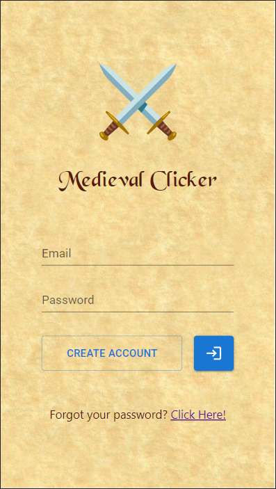
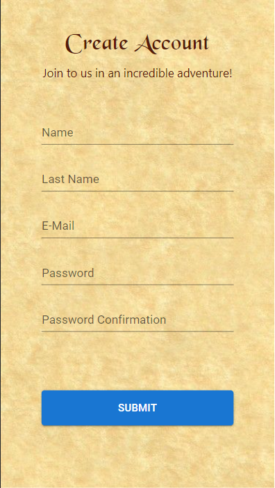
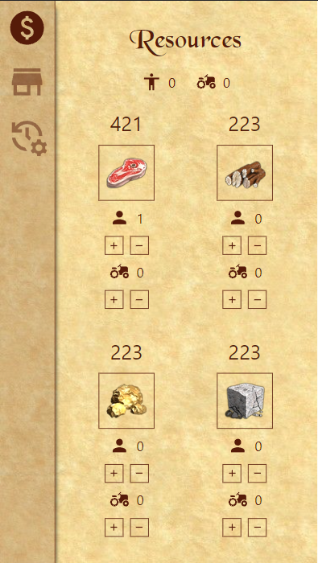
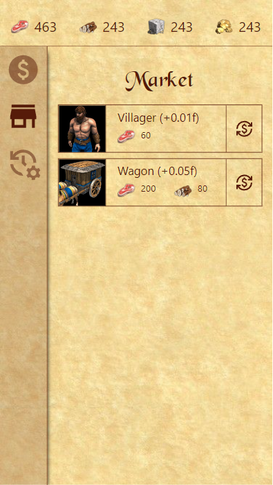

# MEDIEVAL CLICKER
### STUDY / ELECTRONIC GAME

Creation Date: 02/11/2022

 

# DESCRIPTION

Medieval Clicker is an idea based mostly in "clicker" game style, inspired by games like Age of Empires. Rather than use the framework to create applications like web pages or mobile applications, I'm using its powers to create a kind of game that is much dependent on user interface capabilities.

This project is a mix of studies using react web framework with non-natural purposes. My objective is present my expertise using react ecosystem.

 

# DISCLAIMER

This project is meant to be a study and update (2022) about React Framework and its derivatives. It's not a project designed to go live in a production scenario. Things like use LocalStorage to keep game data and browser (client) processing is not at all a good practice in real scenarios, and it only has been applied here to fill the purposes mentioned before.

 

# SCREENSHOTS

<table width="100%">
    <tr>
        <td>
            
        </td>
        <td>
            
        </td>
        <td>
            
        </td>         
    </tr>
    <tr>
        <td>
            
        </td>
        <td>
        </td>
        <td>
        </td>         
    </tr>    
</table>

